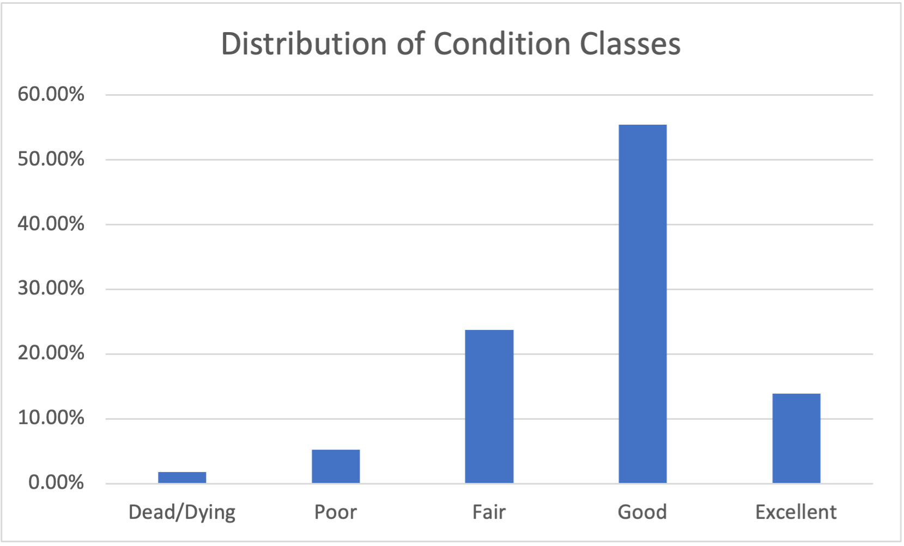
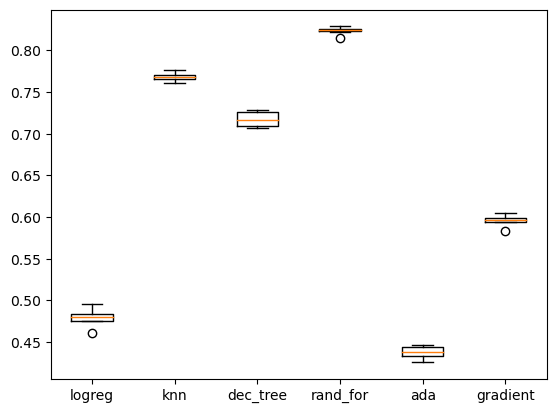
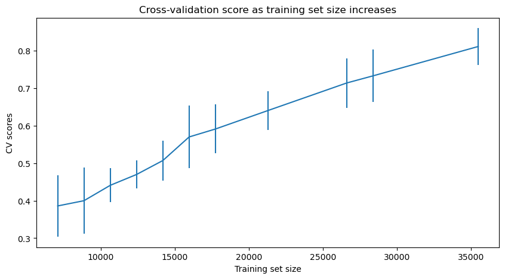
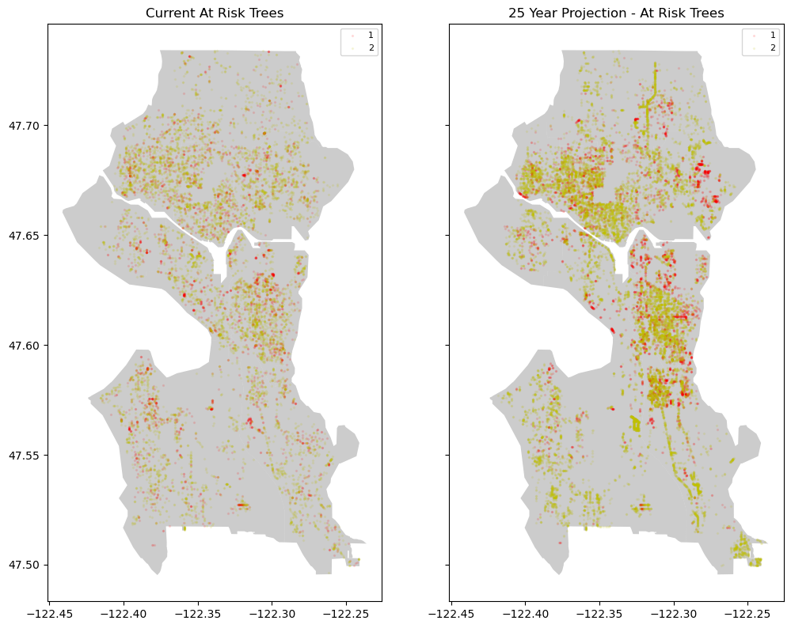
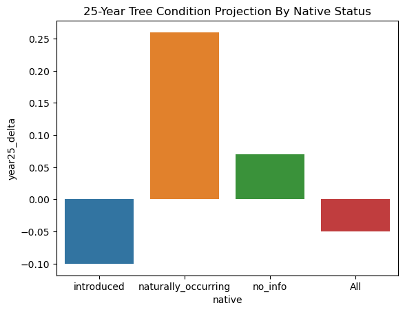
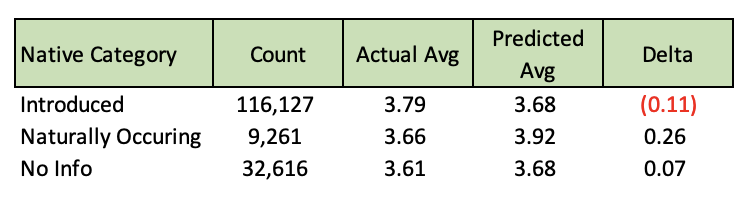

# City Trees: Seattle
## Predicting the Health of Seattle's Urban Tree Cover

\
\
Trees play important roles in urban areas by improving air quality, regulating temperature, limiting stormwater damage, reducing noise pollution, and promoting biodiversity. They can also add beauty and provide space for community gatherings in areas often surrounded by seas of concrete.
\
\
Maintaining what researchers call our "urban tree canopy" is very important for the health of our urban communities. As we are facing climate change, the question becomes: what environmental factors impact the health of our urban tree canopy? And can we predict what that health will be in years to come?

## Data
Our primary data source comes from DataDryad and was published by a group of university students (citation below). It has over 5 million records accross the U.S., but I trimmed down to focus on Seattle, Washington. I also pulled in climate data from NOAA and a crowd-sourced website for Washington precipitation to get temperature, rainfall, and snowfall for weather stations in the greater Seattle metropolitan area.
> * [DataDryad.org](https://datadryad.org/stash/dataset/doi:10.5061/dryad.2jm63xsrf)
> * [NOAA Climate Normals](https://www.ncei.noaa.gov/data/normals-annualseasonal/2006-2020/)
> * [CoCoRaHS Crowd-Sourced Precipitation](https://merbgai.cocorahs.org/ViewData/TotalPrecipSummary.aspx)

## Data Cleaning
Our second climate source came from CoCoRaHS, which standard for the Community Collaborative Rain, Hail, & Snow Network. It is a crowd-sourced website for reporting daily data, with varying levels of completeness. This wasn't my ideal source but created a great opportunity to learn how to work with incomplete data.
\
\
I broke this down into a few steps, first calculating the number of reports, applying an adjustment factor for the possibility of non- reported days having rain or not, and filling missing values with daily averages from close weather stations. I was then able to map in climate data to each tree based on the nearest station from which the data was sourced.
\

## EDA & Outliers
Our tree diameter field had me worried about outliers due to it's wide right tail so I took a look at the boxplot of all the trees and then drilled into some details.
\
\
**Boxplot of Diameters - All Trees**
\

\
\
**Boxplot of Diameters - Eddie's Dogwood**
\

\
\
The aggregate boxplot gave me a more powerful representation of our tailed data. But it was getting into the detail by species that I realized many records had identical diameters. It's possible the large scale of the data required some generalization/binning over precise measurements.
I like to use a 1.5X IQR definition for flagging outliers, but this binning made many of the IQRs equal to 0. To address this, I used the 1.5X IQR flag if for IQRs > 0 and > 3 standard deviations from the mean for IQRs = 0. I then dropped what this function flagged as an outlier, dropping 4,076 records (~2.5% of records).

### Correlation Matrix
To close out my EDA, I plotted a correlation matrix. Unfortunately I did not find an exciting correlation. Instead, just the covariance from some of the climate data I pulled into the analysis. I dropped the duplicative values, leaving me with a final tally of 158,004 rows and 11 columns.
\
\

## Preprocessing & Training
Having this many records proved to be slow when fitting models, so I sampled down to 10,000 records to start. After some trial and error I settled to a few consistent pre-processing steps:
- SimpleImputer using median values for numerical features 
- SimpleImputer using 'missing' for categoricalfeatures 
- StandardScaler on my tree age and climate fields (more normally distributed)
- PowerTransformer on my other numerical fields (more tailed distribution)
- OneHotEncoder on my categorical values, ignoring unknowns
\
\
The categorical encoding became my biggest challenge to transform only my two categorical features, but still scale to new data. I ended up using a custom process using OneHotEncoder, but saving the results to a new dataframe. It works well for the
project but will need some tweaking before scaling more.

### Balancing Data
First tests of models on my training data gave a decent accuracy, but due to having imbalanced classes they were completely ignoring the small classes.
\
\

\
\
To address this imbalance, I used a Synthetic Minority Oversampling Technique (SMOTE) function called SMOTENC which takes in categorical features. This gave me an equal numbers of records in each class for training purposes and I was ready to tune a model.

### Picking the Right Model
After doing some practice training with a logistic regression model, I created a loop that tested cookie cutters of a few different classification models with KFold cross-validation to see which had the most promising results. With this, I decided to invest my time in a Random Forest Classifier model.
\
\

### Model Tuning

Focused on a random forest model, I first used RandomizedSerachCV to get a better idea of how to tune my hyperparamters. The returned best parameters gave a training accuracy and F1 of 100%, and I found max_depth to be the paramater that had the largest wiggle room.
\
\

\
\
In an effort to generalize better to new data, I trimmed the tree down to a max of 40 depth and ran GridSearchCV. This returned a best model using:
- n_estimators = 1,000 
- max_depth = 40 
- min_samples_split = 2 
- min_samples_leaf = 1 
- max_features = 'sqrt'
\
\
As a final check I graphed a learning curve to see if I should use a larger sample.
\
\

\
\
With more data, my final model returned a test set accuracy of 0.59 and macro F1 of 0.42. It's likely even more data would help. But to not burn out my computer, I stuck with 20,000.

## Modeling

I pulled in a .shp file of the greater Seattle metro area to help with the visualization of my model. And with the model we can start adjusting our features to make predictions for the future.

### Model 1: At-Risk Projection

On the 1-5 scale, the values correspond to: 
1. Dead/dying
2. Poor 
3. Fair
4. Good
5. Excellent
\
\
At this scale, I flagged 1s and 2s as "at risk." I then add 25 years to each tree's age, and leaving all else equal, predicted at-risk trees in 2048.
\
\

\
\
You can see the higher density in the colors. Assuming no changes in climate, our at-risk % goes from 7.01% to 13.73%. Of course we know climates are changing, so let's apply that fact to our model.

### Model 2: Model Changing Climate Impacts
I made the following climate changes (on top of the 25-year fast forward):
- Average temperature: +5%
- Total current year rainfall: +5%
- Total current year snowfall: +2%
- Average long-term average rainfall: +8%
\
\

\
\
If these general climate prediction hold true, we could actually see some species of trees thriving more than they are now. Others, however will shift to the at-risk categories. This leads to the question of what types of trees are most at risk. We can answer this question by using the same model, but breaking out the details by type of tree.

### Model 3: What Trees are Most At-Risk

Limiting to only species with >50 occurences, our most at-risk tree is the Cascade Snow Cherry, which is predicted to drop from a 4.0 to a 1.0 (good to dead/dying). But this is just one example, and it got me wondering if whether the tree is native or not will help its chances as the years go by and the climate changes.
\
\

## Future Steps

With some further development this model could help local officials intervene on at-risk trees before its too late to keep our urban tree canopies healthy. 
\
\
It would have benefited from more detailed climate data that doesn’t generalize into only a few weather stations. It could also use more geographic feature engineering like what type of city features were surrounding each tree or how many trees are clustered in a specific area. Things that were beyond my expertise. 
\
\
Once you add those those beneficial features, annual progress and projection updates would be crucial to track the success rate of interventions. 

## Citations
McCoy, Dakota et al. (2022), A dataset of 5 million city trees from 63 US cities: species, location, nativity status, health, and more., Dryad, Dataset, https://doi.org/10.5061/dryad.2jm63xsrf
